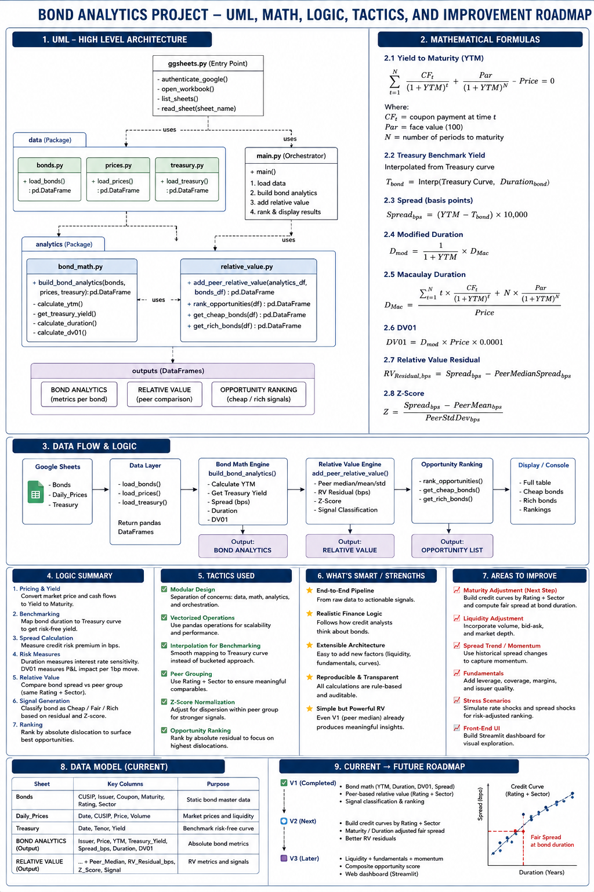

# Credit Relative Value Analytics

## Why This Project?

I have been in the trading industry for 2 years in risk, and market infra--mostly around Equities, Swaps, Derivs, and the mechanics around electronic matching engines.

One thing I kept noticing was that credit markets are much less accessible--both from a data perspective than equities or other highly liquid products. Finding clean, usable data for exploring relative-value opportunities in credit is costly for someone trying to build and experiment independently.

So I decided to build my own credit relative-value analytics framework given the scarcity of data.

This is intentionally a small-scale project. I am just going to API Google Sheets (for the size of the current bond universe, I believe that is sufficient). The focus is not on building complicated infrastructure yet, but on demonstrating the analytics that can sit on top of the data.

The ultimate goal of the project is designed to use Python/C++ (later) to:

* Load and clean bond data
* Calculate bond and spread analytics
* Identify relative-value opportunities across comparable securities
* Visualize pricing and spread relationships
* Run simulations and scenario analysis
* Track positions and profit & loss over time

## Release Version (Code names A-Z)
This is the **Amsterdam GTE release**. I only want to have a working skeleton (UML diagram, raw bond data ingestion to basic actionable relative-value signals). Later on, I will gradually be adding more sophisticated data sources, execution models, portfolio construction, risk analytics, and Market Making features.

### 1> UML Diagram, 2> Bond Math Used, 3> Data Flow Logic, 4> Current Model, 5> Future Road Map 

### Patches
- Amsterdam patch 1: Fix load functions for all 3 files in the data folder. Added Argument --command data to run load functions only for data checking. No need to alaways run the whole thing.